# 🦁 Zootique — Entity Relationship Diagram (ERD)

> **System:** Zootique — A multi-tenant zoo/wildlife park/animal farm management & booking portal  
> **Source:** Figma Designs (Admin + Public UI) + Adviser Transcript + Panel Committee Feedback  
> **Date:** March 28, 2026

---

## System Overview

Zootique is a **one-stop online portal** for all zoos, wildlife parks, and animal farm attractions in the Philippines. It supports:
- **Super Admin** managing the whole platform
- **Zoo/Farm Partners** registering their establishments and managing their own modules
- **Visitors** discovering, booking, and engaging with zoo experiences

---

## ERD Diagram (Mermaid)

```mermaid
erDiagram

    %% ─────────────── USER & ROLES ───────────────
    USERS {
        int user_id PK
        string full_name
        string email
        string password_hash
        string phone
        string profile_picture
        enum user_type "super_admin | zoo_admin | zoo_staff | visitor"
        enum status "active | inactive | suspended"
        datetime created_at
        datetime updated_at
    }

    ROLES {
        int role_id PK
        string role_name "super_admin | zoo_admin | zoo_staff | visitor"
        text permissions
    }

    USER_ROLES {
        int id PK
        int user_id FK
        int role_id FK
        int zoo_partner_id FK "null if visitor or super admin"
    }

    %% ─────────────── ZOO PARTNERS ───────────────
    ZOO_PARTNERS {
        int zoo_partner_id PK
        string name
        enum type "zoo | wildlife_park | farm_animal_attraction"
        string description
        string address
        string city
        string province
        string region
        decimal latitude
        decimal longitude
        string contact_email
        string contact_phone
        string website_url
        string logo_url
        string cover_photo_url
        enum status "pending | active | inactive | suspended"
        int subscription_plan_id FK
        datetime registered_at
        datetime approved_at
    }

    ZOO_MEDIA {
        int media_id PK
        int zoo_partner_id FK
        string file_url
        enum media_type "image | video | video_360"
        string caption
        datetime uploaded_at
    }

    ZOO_ZONES {
        int zone_id PK
        int zoo_partner_id FK
        string zone_name
        string description
        string zone_map_image_url
        decimal position_x
        decimal position_y
        datetime created_at
    }

    %% ─────────────── SUBSCRIPTION ───────────────
    SUBSCRIPTION_PLANS {
        int plan_id PK
        string plan_name "basic | standard | premium"
        decimal price
        enum billing_cycle "monthly | annually"
        text features
        bool is_active
    }

    SUBSCRIPTIONS {
        int subscription_id PK
        int zoo_partner_id FK
        int plan_id FK
        enum status "active | inactive | pending | for_renewal"
        datetime start_date
        datetime end_date
        datetime renewed_at
    }

    %% ─────────────── ANIMALS ───────────────
    ANIMALS {
        int animal_id PK
        int zoo_partner_id FK
        int zone_id FK
        string name
        string species
        string scientific_name
        string description
        string fun_facts
        enum conservation_status "least_concern | vulnerable | endangered | critically_endangered | extinct_wild | extinct"
        enum health_status "healthy | under_treatment | quarantine | deceased"
        string photo_url
        datetime date_added
    }

    %% ─────────────── SERVICES / TICKETS ───────────────
    SERVICES {
        int service_id PK
        int zoo_partner_id FK
        string name
        string description
        enum service_type "general_admission | guided_tour | family_bundle | vip_access | school_group | corporate"
        decimal price
        int capacity_per_day
        string image_url
        bool is_active
    }

    %% ─────────────── BOOKINGS ───────────────
    BOOKINGS {
        int booking_id PK
        int visitor_id FK
        int zoo_partner_id FK
        int service_id FK
        date visit_date
        int num_pax
        enum booking_type "individual | group | school | corporate"
        enum status "pending | confirmed | cancelled | completed"
        decimal total_amount
        decimal discount_applied
        string promo_code_used
        string qr_code_url
        datetime created_at
    }

    BOOKING_ITEMS {
        int item_id PK
        int booking_id FK
        int service_id FK
        int quantity
        decimal unit_price
        decimal subtotal
    }

    %% ─────────────── PAYMENTS ───────────────
    PAYMENTS {
        int payment_id PK
        int booking_id FK
        decimal amount
        enum payment_method "gcash | maya | credit_card | cash_on_site"
        enum status "pending | paid | failed | refunded"
        string transaction_ref
        datetime paid_at
    }

    %% ─────────────── TICKETS ───────────────
    TICKETS {
        int ticket_id PK
        int booking_id FK
        int visitor_id FK
        string qr_code
        enum ticket_type "general | vip | group | school"
        enum status "unused | used | expired | cancelled"
        datetime used_at
        datetime expires_at
    }

    %% ─────────────── EVENTS ───────────────
    EVENTS {
        int event_id PK
        int zoo_partner_id FK
        int zone_id FK
        string title
        string description
        enum event_type "feeding | educational_talk | shows | field_trip | corporate | seasonal"
        datetime start_datetime
        datetime end_datetime
        int capacity
        bool is_bookable
        string image_url
        datetime created_at
    }

    EVENT_REGISTRATIONS {
        int reg_id PK
        int event_id FK
        int visitor_id FK
        int booking_id FK
        datetime registered_at
    }

    %% ─────────────── PROMOTIONS ───────────────
    PROMOTIONS {
        int promo_id PK
        int zoo_partner_id FK "null = platform-wide promo"
        string promo_name
        string promo_code
        enum discount_type "percentage | fixed"
        decimal discount_value
        int max_uses
        int uses_count
        datetime valid_from
        datetime valid_until
        bool is_active
        enum created_by "super_admin | zoo_admin"
    }

    %% ─────────────── FEEDBACK & REVIEWS ───────────────
    FEEDBACKS {
        int feedback_id PK
        int visitor_id FK
        int zoo_partner_id FK
        int booking_id FK
        int rating "1-5"
        text comment
        datetime submitted_at
    }

    %% ─────────────── VISITOR POINTS & REFERRALS ───────────────
    VISITOR_PROFILES {
        int profile_id PK
        int user_id FK
        int total_points
        int redeemable_points
        string referral_code
        int referred_by_user_id FK "self-referencing"
        datetime joined_at
    }

    POINTS_TRANSACTIONS {
        int transaction_id PK
        int visitor_id FK
        int points
        enum type "earned | redeemed | expired"
        string source "referral | booking | gamification | scan"
        datetime transacted_at
    }

    %% ─────────────── MEMBERSHIPS ───────────────
    MEMBERSHIP_PLANS {
        int membership_plan_id PK
        int zoo_partner_id FK "null = platform-wide"
        string plan_name
        decimal price
        int duration_days
        text perks
        int discount_percentage
    }

    VISITOR_MEMBERSHIPS {
        int membership_id PK
        int visitor_id FK
        int membership_plan_id FK
        enum status "active | expired | cancelled"
        datetime start_date
        datetime end_date
    }

    %% ─────────────── DONATIONS ───────────────
    DONATIONS {
        int donation_id PK
        int donor_id FK "visitor user_id"
        int zoo_partner_id FK
        decimal amount
        string message
        enum payment_method "gcash | maya | credit_card"
        enum status "pending | completed | failed"
        datetime donated_at
    }

    %% ─────────────── GAMIFICATION / SCAVENGER HUNT ───────────────
    GAMIFICATION_CHALLENGES {
        int challenge_id PK
        int zoo_partner_id FK
        string title
        string description
        int points_reward
        string qr_code_trigger
        bool is_active
    }

    VISITOR_CHALLENGE_LOG {
        int log_id PK
        int visitor_id FK
        int challenge_id FK
        datetime completed_at
        int points_awarded
    }

    %% ─────────────── NOTIFICATIONS ───────────────
    NOTIFICATIONS {
        int notif_id PK
        int user_id FK
        string title
        text message
        enum type "booking | event | promotion | system | feedback"
        bool is_read
        datetime sent_at
    }

    %% ─────────────── IOT DEVICES ───────────────
    IOT_DEVICES {
        int device_id PK
        int zoo_partner_id FK
        int zone_id FK
        string device_name
        enum type "temperature_sensor | air_quality | energy_monitor"
        string mac_address
        enum status "online | offline | error"
        datetime installed_at
    }

    IOT_READINGS {
        int reading_id PK
        int device_id FK
        decimal value
        string unit
        datetime recorded_at
    }

    %% ─────────────── RELATIONSHIPS ───────────────

    USERS ||--o{ USER_ROLES : "assigned"
    ROLES ||--o{ USER_ROLES : "defines"
    ZOO_PARTNERS ||--o{ USER_ROLES : "employs"

    ZOO_PARTNERS ||--o{ ZOO_MEDIA : "has"
    ZOO_PARTNERS ||--o{ ZOO_ZONES : "contains"
    ZOO_PARTNERS ||--|| SUBSCRIPTIONS : "subscribes"
    SUBSCRIPTION_PLANS ||--o{ SUBSCRIPTIONS : "defines"

    ZOO_PARTNERS ||--o{ ANIMALS : "houses"
    ZOO_ZONES ||--o{ ANIMALS : "located in"

    ZOO_PARTNERS ||--o{ SERVICES : "offers"
    ZOO_PARTNERS ||--o{ EVENTS : "hosts"
    ZOO_ZONES ||--o{ EVENTS : "located in"

    USERS ||--o{ BOOKINGS : "makes"
    ZOO_PARTNERS ||--o{ BOOKINGS : "receives"
    SERVICES ||--o{ BOOKINGS : "booked as"
    BOOKINGS ||--o{ BOOKING_ITEMS : "contains"
    SERVICES ||--o{ BOOKING_ITEMS : "itemized"
    BOOKINGS ||--o| PAYMENTS : "paid via"
    BOOKINGS ||--o{ TICKETS : "generates"
    USERS ||--o{ TICKETS : "owns"

    EVENTS ||--o{ EVENT_REGISTRATIONS : "registered for"
    USERS ||--o{ EVENT_REGISTRATIONS : "registers"
    BOOKINGS ||--o| EVENT_REGISTRATIONS : "linked"

    ZOO_PARTNERS ||--o{ PROMOTIONS : "creates"
    ZOO_PARTNERS ||--o{ FEEDBACKS : "receives"
    USERS ||--o{ FEEDBACKS : "submits"
    BOOKINGS ||--o| FEEDBACKS : "related to"

    USERS ||--|| VISITOR_PROFILES : "has"
    VISITOR_PROFILES ||--o{ POINTS_TRANSACTIONS : "tracks"

    ZOO_PARTNERS ||--o{ MEMBERSHIP_PLANS : "offers"
    USERS ||--o{ VISITOR_MEMBERSHIPS : "subscribes"
    MEMBERSHIP_PLANS ||--o{ VISITOR_MEMBERSHIPS : "defines"

    USERS ||--o{ DONATIONS : "donates"
    ZOO_PARTNERS ||--o{ DONATIONS : "receives"

    ZOO_PARTNERS ||--o{ GAMIFICATION_CHALLENGES : "defines"
    USERS ||--o{ VISITOR_CHALLENGE_LOG : "completes"
    GAMIFICATION_CHALLENGES ||--o{ VISITOR_CHALLENGE_LOG : "logged"

    USERS ||--o{ NOTIFICATIONS : "receives"

    ZOO_PARTNERS ||--o{ IOT_DEVICES : "owns"
    ZOO_ZONES ||--o{ IOT_DEVICES : "monitors"
    IOT_DEVICES ||--o{ IOT_READINGS : "records"
```



---

## Entity Summary Table

| Entity | Description | Key Relations |
|---|---|---|
| **USERS** | All system users (super admin, zoo admin, staff, visitors) | User roles, bookings, feedback, tickets |
| **ROLES** | Role definitions and permissions | Assigned via USER_ROLES |
| **USER_ROLES** | Junction: user ↔ role ↔ zoo partner | USERS, ROLES, ZOO_PARTNERS |
| **ZOO_PARTNERS** | Registered zoos, wildlife parks, farms | Core entity for all zoo-specific data |
| **ZOO_MEDIA** | Photos, videos, 360° media per zoo | ZOO_PARTNERS |
| **ZOO_ZONES** | Map zones/areas inside a zoo | ZOO_PARTNERS, ANIMALS, EVENTS, IOT |
| **SUBSCRIPTION_PLANS** | Platform subscription tiers (basic/standard/premium) | SUBSCRIPTIONS |
| **SUBSCRIPTIONS** | Zoo partner's active subscription status | ZOO_PARTNERS, SUBSCRIPTION_PLANS |
| **ANIMALS** | Animal catalog per zoo with health & conservation data | ZOO_PARTNERS, ZOO_ZONES |
| **SERVICES** | Ticket types (general, VIP, tours, group, school) | ZOO_PARTNERS, BOOKINGS |
| **BOOKINGS** | Visitor reservations for zoo visits | USERS, ZOO_PARTNERS, SERVICES, PAYMENTS |
| **BOOKING_ITEMS** | Line items in a booking | BOOKINGS, SERVICES |
| **PAYMENTS** | Payment records per booking | BOOKINGS |
| **TICKETS** | QR-coded digital tickets per booking | BOOKINGS, USERS |
| **EVENTS** | Zoo events (feeding, shows, field trips, corporate) | ZOO_PARTNERS, ZOO_ZONES |
| **EVENT_REGISTRATIONS** | Visitor sign-ups per event | EVENTS, USERS, BOOKINGS |
| **PROMOTIONS** | Vouchers and discount codes | ZOO_PARTNERS (or platform-wide) |
| **FEEDBACKS** | Visitor ratings and reviews | USERS, ZOO_PARTNERS, BOOKINGS |
| **VISITOR_PROFILES** | Loyalty points, referral codes per visitor | USERS, POINTS_TRANSACTIONS |
| **POINTS_TRANSACTIONS** | History of earned/redeemed points | VISITOR_PROFILES |
| **MEMBERSHIP_PLANS** | Visitor membership tiers with perks | ZOO_PARTNERS |
| **VISITOR_MEMBERSHIPS** | A visitor's active membership | USERS, MEMBERSHIP_PLANS |
| **DONATIONS** | Conservation/wildlife donation records | USERS, ZOO_PARTNERS |
| **GAMIFICATION_CHALLENGES** | QR-based scavenger hunts inside zoo | ZOO_PARTNERS |
| **VISITOR_CHALLENGE_LOG** | Visitor's completed gamification activities | USERS, GAMIFICATION_CHALLENGES |
| **NOTIFICATIONS** | System alerts (bookings, events, promos) | USERS |
| **IOT_DEVICES** | Temperature/air quality sensors per zone | ZOO_PARTNERS, ZOO_ZONES |
| **IOT_READINGS** | Sensor data log per device | IOT_DEVICES |

---

## Key Design Decisions

> [!NOTE]
> **Multi-tenancy**: `ZOO_PARTNERS` is the central tenant entity. All zoo-specific data (animals, zones, services, events, staff) is scoped to a `zoo_partner_id`.

> [!IMPORTANT]
> **Two registration types**: From the Figma design, registration is split — `ZOO_PARTNERS` for establishments and `VISITORS` (via `USERS` + `VISITOR_PROFILES`) for the public. These flow into different admin panels.

> [!TIP]
> **Referral System**: `VISITOR_PROFILES.referral_code` + `referred_by_user_id` self-references `USERS` to enable the referral/points system the adviser described.

> [!NOTE]
> **QR Tickets → Navigation**: `TICKETS.qr_code` is the gateway to the mobile navigation feature discussed by the panel — scanning leads to the zoo's interactive map.

> [!TIP]
> **IoT (Future-ready)**: `IOT_DEVICES` and `IOT_READINGS` are included based on the adviser's mention of temperature monitoring and energy conservation sensors per zone.

---

## Actors & Modules Summary

```
Zootique Super Admin
    └─ Manage Zoo Partners (approve/reject, subscriptions)
    └─ Manage Platform Promotions & Vouchers
    └─ View Platform-wide Reports & Analytics
    └─ Manage Users & Roles
    └─ Manage Notifications

Zoo Admin / Zoo Staff
    └─ Manage Animals & Exhibits (by zone)
    └─ Manage Services & Ticket Types
    └─ Manage Bookings & Schedules
    └─ Manage Events & Shows
    └─ Manage Promotions (zoo-level)
    └─ View Visitor Feedback
    └─ View Reports & Revenue
    └─ Manage Zoo Media (photos, 360 videos)
    └─ Define Gamification Challenges
    └─ Monitor IoT Devices

Visitor
    └─ Browse Zoo Directory
    └─ Book Visits & Tickets
    └─ View QR Ticket & Navigate Zoo Map
    └─ View Animals & Educational Content
    └─ Register for Events
    └─ Apply Promos & Vouchers
    └─ Earn & Redeem Loyalty Points
    └─ Refer Friends
    └─ Rate & Review Zoo
    └─ Donate to Wildlife Conservation
    └─ Participate in Scavenger Hunt / Gamification
    └─ Manage Profile & Membership
```
